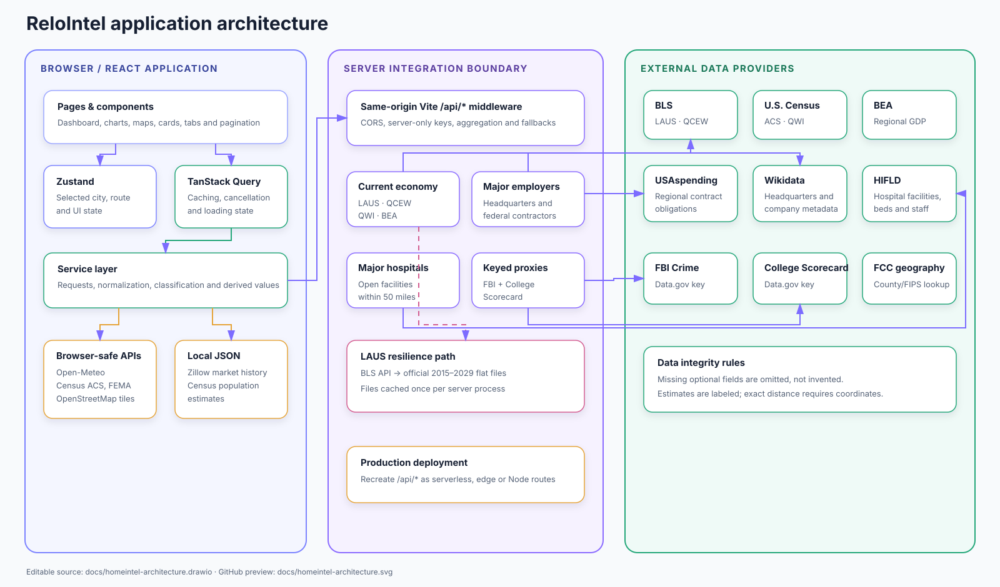

# HomeIntel

HomeIntel is a React and TypeScript relocation-decision application. It helps someone considering a move research a city, simulate what living there would actually cost them, understand where they would be most likely to regret the move, and turn the answer into an executable plan.

The application is organised around two jobs:

- **Research** the place — housing, population, employment, hazards, weather, schools, employers, and commute.
- **Decide** whether to move — a personalised cost simulation, an explainable regret check, a day-in-the-life preview, a structured decision brief, and a 90-day move plan.

Every displayed figure is traceable to a named public source or to a household assumption the user entered. **No language model or generative AI produces any number, score, verdict, or recommendation in this application.** All calculations are pure, deterministic TypeScript functions with unit tests.

The application does not start with a hard-coded city. Selected cities live in Zustand; the household profile lives in a separate persisted store; remote data is loaded and cached through TanStack Query.

New here? Read the **[User Guide](UserGuide.md)** for a task-by-task walkthrough of the interface. This README covers what the application is, how it is built, and where the data comes from.

## Features

### Decide

- **Decision Brief** at `/decision-brief`: a structured verdict, what fits, what would have to be solved, a per-section brief, questions to answer on the ground, and a printable layout
- **Regret Check**: ten independently explainable regret factors, each with a 0-100 risk, a plain-language headline, and its supporting evidence
- Factors that cannot be measured are reported as unassessed with the reason, instead of being silently scored as zero
- **Origin city comparison**: housing-cost shock, real salary adjustment, commute shock, climate mismatch, and distance from a support network are measured against the city the household lives in today
- **Day in Your Life** at `/day-in-the-life`: five scenarios — office workday, remote day, family weekend, winter day, extreme-weather day — each built from a real observed day in the city's weather record
- Climate profile from three years of observed daily weather: comfortable days inside a user-defined temperature band, hot days, freezing nights, wet days, snow days, and per-season shape
- **Neighbourhoods** at `/neighborhoods`: pin a real home address and workplace, and read census-tract FEMA risk, a routed commute, and service distances measured from that point rather than the city centre
- **Move Plan** at `/move-plan`: a saved city shortlist, an editable move budget derived from household size and distance, and a 90-day task timeline
- **Test-drive itinerary**: a three-day research-trip plan scheduled for the city's hardest season, with each stop tied to the regret factor it resolves
- **Life Simulator** at `/life-simulator`: deterministic monthly disposable-income model with no AI-generated calculations
- Monthly cost model with editable income, tax, household, commute, healthcare, childcare, debt, and essential-cost assumptions
- Rent and buy scenarios, including a transparent 30-year fixed-mortgage calculation
- Total housing exposure combining housing, utilities, transportation, and a FEMA-based planning reserve
- Explainable deal-breaker matching, weighted city-fit results, and relocation-regret risk
- Deal-breakers that activate only once the underlying measurement exists, including commute time, hospital distance, and comfortable-weather days
- Career compatibility using Census employment rates, worker earnings, and industry categories
- Job-market concentration measured with a Herfindahl index across the 13 Census employment sectors
- Two-person household consensus with independent priority weights and optional second-city comparison
- Data-confidence ratings that distinguish strong source coverage from broader estimates or unavailable data, including the geography each value actually describes
- Per-city move-readiness checklists and a household profile saved on the device

### Research

- Worldwide city and ZIP-code search through Open-Meteo
- Interactive Leaflet map with OpenStreetMap tiles
- Compact live weather summary on Overview, with daily high/low, humidity, and wind details on Environment
- Interactive Environment-page commute map with click-to-select start and destination points
- Current traffic-aware drive time, free-flow comparison, delay, and condition when TomTom is configured
- Sampled morning and evening rush-hour travel times with the slowest weekday window identified
- Baseline point-to-point routing when live traffic is unavailable, without presenting fallback results as live
- Nearby OpenStreetMap bus, train, subway, and tram stops plus transparent walking and cycling estimates
- Outdoor comfort estimate based on feels-like temperature, humidity, wind, precipitation, and storm conditions
- Zillow ZHVI typical home values and ZORI market rents
- Expandable Housing metric details with direct Zillow and Census source citations
- Census ACS housing, demographic, education, and employment indicators
- Census ACS race and ethnicity composition using mutually exclusive B03002 categories
- Public K-12 school discovery using the nationwide Common Core of Data (CCD)
- Grade-band tabs for Pre-K, Kindergarten, grades 1-6, middle/high school, and statewide online schools
- K-12 search by school name, district, or address, with pagination and expandable metadata
- Current BLS LAUS city labor conditions with downloadable-file fallback
- Annual employment momentum from 2019 through 2026, using reported monthly data when available and clearly marked QCEW-based estimates otherwise
- Census QWI county workforce flows and optional BEA county GDP growth
- Regional employment landscape with sector tabs, company links, pagination, federal contractors, nearby headquarters, and major hospitals
- Census Vintage 2025 city population estimates
- Calculated current-year population based on a linear trend fitted to official 2023–2025 city estimates
- FEMA National Risk Index profile and individual hazard scores
- Housing, People, Employment, Risk, and Environment pages
- Housing and demographic visualizations
- Data-driven HomeIntel Briefs for Housing and People
- Side-by-side city comparison interface
- Lightweight Overview queries that avoid loading detail-only employment and demographic requests

### Interface

- Command palette on `Ctrl`/`Cmd` + `K` for jumping between pages, searching any city, and switching theme
- Landing page sets the whole move up front: where you live now and where you are considering, before entering the app
- Sidebar grouped into Research and Decide, with a "Your move" card showing where you are moving from and to
- Either leg can be changed in place from that card, cleared on its own, or both reset at once
- Clicking the HomeIntel wordmark starts over: it clears the selected cities and returns to the landing search, while keeping the household profile, shortlist, and saved progress
- First-visit quick-start guide plus accessible field and confidence tooltips for mouse, keyboard, and touch users
- Source provenance attached to individual statements rather than to a page footnote
- Selected cities and the household profile survive a reload, so page URLs can be shared and revisited
- An error boundary that reports what failed instead of blanking the page
- Print stylesheet for the Decision Brief
- Responsive desktop and mobile layouts
- Animated, hover-responsive charts with reduced-motion support
- Persistent light and dark appearance modes
- Material UI loading indicators
- ESLint and Prettier integration

## Technology

- React
- TypeScript
- Vite
- Zustand
- TanStack Query
- Material UI
- Radix UI Primitives
- Tailwind CSS 4 with the official Vite plugin
- React Leaflet and Leaflet
- Lucide React
- ESLint and Prettier

## Getting started

### Requirements

- Node.js 22 or newer
- npm
- A free U.S. Census Data API key

### Installation

```bash
npm install
```

Copy `.env.example` to `.env` and provide the Census and Data.gov keys:

```env
VITE_CENSUS_API_KEY=your_census_api_key
DATA_GOV_API_KEY=your_data_gov_api_key
```

Request a Census key at <https://api.census.gov/data/key_signup.html> and a Data.gov key at <https://api.data.gov/signup/>.

Start the application:

```bash
npm run dev
```

Vite normally serves the application at `http://localhost:5173`. Restart the development server after changing `.env`.

Once it is running, the **[User Guide](UserGuide.md)** walks through the interface
task by task: researching a city, describing your household, reading the regret
check, pinning a neighbourhood, and building a move plan.

## Commands

| Command                   | Purpose                                                                    |
| ------------------------- | -------------------------------------------------------------------------- |
| `npm run dev`             | Start the Vite development server                                          |
| `npm run build`           | Type-check and create a production build                                   |
| `npm run preview`         | Preview the production build                                               |
| `npm run lint`            | Run ESLint                                                                 |
| `npm run lint:fix`        | Fix supported ESLint issues                                                |
| `npm run format`          | Format the repository with Prettier                                        |
| `npm run format:check`    | Check formatting without editing files                                     |
| `npm test`                | Run every deterministic calculation test in `tests/`                       |
| `npm run data:update`     | Refresh the normalized Zillow Research dataset                             |
| `npm run build:with-data` | Refresh Zillow data and create a production build                          |
| `npm run validate`        | Refresh Zillow data, check formatting, lint, build, and audit dependencies |

## Data sources

### Open-Meteo

Open-Meteo provides two keyless services:

- Geocoding: `https://geocoding-api.open-meteo.com/v1/search`
- Weather: `https://api.open-meteo.com/v1/forecast`

The weather request uses the selected coordinates and includes temperature, apparent temperature, humidity, weather code, wind speed, and daily high/low in local time.

### Open-Meteo Historical Archive

The Day in Your Life page and the climate-mismatch regret factor use the
Open-Meteo historical archive, which returns observed daily weather for the
nearest reanalysis grid cell. HomeIntel requests three years of daily maximum
and minimum temperature, precipitation, snowfall, weather code, sunrise,
sunset, and daylight duration.

`src/services/climate.ts` turns those records into a climate profile: the
number of days a year that fall inside the household's own comfortable
temperature band, hot days at or above 90 °F, very hot days at or above 100 °F,
nights below freezing, wet days, snow days, per-season averages, and a set of
genuinely observed representative days. The representative days are what the
Day in Your Life scenarios are built from, so the sunrise, sunset, and
temperatures shown for a scenario are real recorded values and the page names
the date they came from.

Because the comfort band is a user preference, HomeIntel recalculates the
profile locally when the band changes instead of refetching several years of
daily weather.

### OpenStreetMap Nominatim

The Neighbourhoods page needs a specific address rather than a city, so
`/api/place-search` proxies OpenStreetMap's Nominatim geocoder. The proxy sets
an identifying `User-Agent`, serialises requests to at most one per second, and
caches each result for seven days, as Nominatim's usage policy requires.

Results are biased toward the city being researched but not restricted to it,
so a workplace in a neighbouring suburb is still findable.

### OpenStreetMap

The selected location is rendered with React Leaflet and OpenStreetMap tiles. Required map attribution remains visible.

The Environment commute planner also queries nearby mapped bus stops, train stations, subway entrances, and tram stops through a same-origin Overpass proxy. These records indicate mapped infrastructure only; they do not provide timetables, fares, service alerts, accessibility, or a complete public-transit itinerary.

### TomTom traffic and routing

When the optional server-only `TOMTOM_API_KEY` is configured, the Environment commute planner uses TomTom's Calculate Route API with traffic enabled. The current route response includes traffic-aware travel time, free-flow time, traffic delay, distance, and route geometry. Six future weekday departure samples—6:30, 7:30, and 8:30 AM plus 4:00, 5:00, and 6:00 PM—use TomTom's time-dependent historical traffic model to compare common rush-hour windows.

If the key is absent or TomTom is temporarily unavailable, the proxy requests an OSRM baseline road route. The interface labels this as **Baseline routing**, hides live congestion and rush-hour claims, and explains how to enable traffic data. Walking and cycling times are distance-only estimates and are not pedestrian- or bicycle-routed itineraries.

### Zillow Research

Housing uses Zillow's public Research downloads:

- ZHVI: typical home value
- ZORI: typical observed market rent

These are market indices, not individual-property Zestimates or guaranteed asking rents. The updater normalizes Zillow's city CSV files into:

```text
public/data/zillow-market.json
```

Source: <https://www.zillow.com/research/data/>

### Census ACS 2020–2024

The ACS five-year detailed tables provide data for all U.S. places. HomeIntel uses them for:

- Population fallback and 2019 comparison
- Median household income
- Median age
- Employment rate
- Bachelor's degree or higher
- Average household size
- Foreign-born population share
- Owner-occupied housing share
- Home value and gross-rent fallbacks

Important variables include:

| Variable      | Meaning                              |
| ------------- | ------------------------------------ |
| `B01003_001E` | Total population                     |
| `B01002_001E` | Median age                           |
| `B19013_001E` | Median household income              |
| `B23025_003E` | Civilian labor force                 |
| `B23025_004E` | Employed civilian labor force        |
| `B15003_*`    | Educational attainment               |
| `B25010_001E` | Average household size               |
| `B05002_*`    | Nativity and foreign-born population |
| `B03002_*`    | Hispanic or Latino origin by race    |
| `B25003_002E` | Owner-occupied housing units         |
| `B25003_003E` | Renter-occupied housing units        |
| `B25077_001E` | Median owner-occupied home value     |
| `B25064_001E` | Median gross rent                    |

Employment industries and median worker earnings come from the ACS DP03 Selected Economic Characteristics profile. Detailed ACS table C24030 separates Information, Professional services, Management & administrative services, Educational services, and Health care & social assistance. ACS table B24134 further breaks professional, scientific, and technical services into detailed industries. Information and Professional Services remain separate sectors in the chart. The Professional Services detail list below the chart shows each industry returned by B24134 without adding those industries to the pie-chart legend.

The employment service resolves the Census state FIPS code from a local state table instead of making a separate state-discovery request. After the initial place lookup identifies the Census place code, C24030, B24134, and the six annual-history requests run concurrently. Browser-side Census requests have a 12-second timeout and remain cancellable when the selected city changes.

### Census Vintage 2025 population estimates

The official Census Vintage 2025 incorporated-place table supplies point estimates for 2023, 2024, and 2025. The normalized local lookup contains approximately 19,500 incorporated places:

```text
public/data/census-population-2025.json
```

HomeIntel calculates the current-year value with an ordinary least-squares linear trend fitted to all three official annual population levels:

```text
mean year = average(2023, 2024, 2025)
mean population = average(population 2023, population 2024, population 2025)
slope = sum((year - mean year) * (population - mean population)) / sum((year - mean year)^2)
population 2026 = mean population + slope * (2026 - mean year)
```

The 2026 result is a HomeIntel calculation, not an official Census estimate. The interface labels it accordingly. If the selected location does not match an incorporated place in the Vintage 2025 table, the application keeps the 2024 ACS value and explains that the 2025 city estimate was unavailable.

The People chart compares the 2019 ACS estimate with the calculated current-year value. These are different Census series, so the comparison is useful for broad context but should not be treated as a precise official time series.

The demographics service resolves state FIPS codes locally, eliminating a Census state-discovery call. After the selected Census place is identified, state and national education comparisons, the 2019 population observation, and the local Vintage 2025 dataset load concurrently. Census calls have a 12-second timeout and optional comparison failures do not discard the primary city demographics.

Source: <https://www.census.gov/newsroom/press-kits/2026/vintage-2025-city-town-pop-estimates.html>

### FBI Crime Data Explorer

Reported violent crime comes from the FBI's Crime Data Explorer through the
`/api/fbi-crime` proxy, which keeps the Data.gov key server-side. HomeIntel
averages the 2023 monthly state offence rate and divides it by the national
average, producing an index where **100 is the US average**.

Two limitations matter, and the application repeats both wherever the number
appears:

- **It is a state rate, not a city or neighbourhood rate.** Violent crime varies enormously within a state, so the index is context, never a verdict on an address.
- **Reporting is voluntary and incomplete.** Agency participation in UCR/NIBRS varies by state and year, so the underlying counts are not a complete census of offences.

For those reasons the value is rated **Estimated** in the confidence roster even
though the source is authoritative, and the regret factor that uses it carries a
`basis` of `estimated` rather than `measured`.

### FEMA National Risk Index

The Risk Profile uses FEMA's December 2025 National Risk Index Census-tract layer. The selected city's longitude and latitude identify the containing tract. HomeIntel displays:

- Composite Expected Annual Loss score and rating
- Highest individual natural-hazard Expected Annual Loss scores
- Inland-flooding Expected Annual Loss score
- Community-resilience score and rating

Expected Annual Loss combines modeled hazard frequency, exposure, and estimated consequences. Scores are normalized from 0 to 100 relative to other Census tracts; they are not disaster probabilities, citywide averages, property-level forecasts, dollar-loss predictions, or insurance determinations. The interface identifies the selected Census tract to make this geographic limitation explicit. FEMA risk data is available only for U.S. locations.

Source: <https://hazards.fema.gov/nri/>

### Current employment and annual economic momentum

The Employment page combines several public labor and economic sources:

- BLS Local Area Unemployment Statistics (LAUS) for city employment and unemployment
- BLS Quarterly Census of Employment and Wages (QCEW) for county employment growth and wages
- Census Quarterly Workforce Indicators (QWI) for county hires and separations
- BEA Regional data for county real GDP when `BEA_API_KEY` is configured

The server first requests LAUS through the BLS Public Data API. That unauthenticated API has a daily request quota. If the API is unavailable, rate-limited, or returns empty series, HomeIntel resolves the selected city's LAUS area code dynamically and reads the official BLS five-year downloadable files:

```text
la.data.0.CurrentU15-19
la.data.0.CurrentU20-24
la.data.0.CurrentU25-29
```

These files are downloaded once per server process and cached in memory. The fallback is not tied to San Diego or Dallas; it works for any U.S. city represented in the BLS LAUS area file. The chart uses monthly annual averages and marks an incomplete current year as `YTD`. If reported LAUS data does not yet reach the current year, the chart extends the latest employment value using the newest available QCEW covered-job growth rate and marks the result `est.`.

The Current unemployment card always displays the observation period and geography. A value such as June 2026 is a reported monthly LAUS rate, not a HomeIntel forecast. After a single FCC coordinate-to-county lookup, LAUS, QCEW, QWI, and optional BEA work starts concurrently. QCEW and QWI candidate quarters are also requested concurrently and the newest available observation is selected in configured order. Individual provider failures degrade to unavailable cards instead of failing the combined response.

### Regional employment landscape

The Regional Employment Landscape is assembled dynamically for the selected U.S. city:

- **USAspending:** federal contract recipients with recent contract work performed in surrounding counties. Totals cover the latest three years and represent contract obligations, not local employee counts.
- **Wikidata:** strategic companies whose headquarters coordinates are within 85 kilometers (about 53 miles) of the selected city center. Headquarters distance is calculated from the returned geospatial distance.
- **U.S. Hospitals HIFLD feature service:** open hospital facilities within a 50-mile radius. Major facilities are ranked using reported beds, staff, and distance. Hospital websites appear only when supplied by the source.

Companies are classified into sectors such as Defense & government, Technology, Health & life sciences, Advanced manufacturing, Finance, Energy, and Transportation. The four strongest available sector groups are shown, and Health & life sciences is retained whenever qualifying health organizations or hospitals are found. Each tab displays six cards per page; switching tabs resets the destination tab to page 1.

Federal contract place-of-performance data is county-based, so its geography is an approximate surrounding region rather than an exact 50-mile circle. A contractor card does not show distance because USAspending does not consistently provide an office coordinate. Hospital and Wikidata-headquarters cards show distance because those sources provide facility coordinates.

USAspending recipients use source-provided details or a small curated profile for well-known companies; the application does not issue per-company Wikidata lookups. Five FCC samples—the city center and four cardinal points—identify surrounding counties before one USAspending aggregation request. The three employer sources use separate TanStack Query entries and load independently, so available results render without waiting for the slowest provider. Components do not call third-party APIs directly when a same-origin proxy is required.

#### Employment performance configuration

The employment refactor uses bounded requests and layered caching:

- Direct Census employment requests time out after 12 seconds. The employer browser requests time out after 15 seconds.
- Server-side upstream requests time out after 12 seconds unless an endpoint defines a narrower policy.
- `/api/current-economy` caches each successful city response in server memory for six hours and sends `Cache-Control: private, max-age=21600`.
- `/api/major-employers`, `/api/federal-contractors`, and `/api/major-hospitals` cache successful coordinate-based responses in server memory for 24 hours and send `Cache-Control: private, max-age=86400`.
- LAUS area metadata and fallback flat files are shared across requests for the lifetime of the server process. A failed initial download clears its promise so a later request can retry.
- Employer queries retry once in TanStack Query. A loading indicator remains visible while slower sources continue, but already-returned source data is usable immediately.

The proxy's in-memory caches are process-local and reset when Vite or the production server restarts. Browsers may continue using a fresh response according to its `Cache-Control` header; use a hard reload when testing a forced refresh. A production implementation should preserve the same response contracts, timeout behavior, and cache lifetimes when moving the handlers to serverless or edge infrastructure.

### Public K-12 and statewide online schools

The People page loads public-school directory records from the Urban Institute Education Data Portal, which republishes the U.S. Department of Education Common Core of Data (CCD). The API is free, requires no key, and currently uses the 2024 school directory endpoint.

Schools and colleges are collapsed secondary sections and do not request data during the People page's initial render. Each query is enabled the first time its section is opened. The `/api/nearby-schools` proxy downloads only open, regular schools for the selected state, caches that filtered state dataset once per server process, and returns two collections:

- Schools whose reported physical city matches the selected city. A 15-mile coordinate fallback is used only when no exact city records are found.
- Fully virtual public schools from the entire selected state (`virtual === 1`). Statewide online results are not limited to the selected city because an administrative address does not define where virtual students attend.

Local records are organized into Pre-K, Kindergarten, grades 1-6, and middle/high tabs from reported grade ranges and CCD grade-band flags. A school can appear in multiple tabs when it serves multiple grade bands. The Online tab contains statewide fully virtual schools; Texas results were verified to include University of Texas at Austin High School and Texas Tech University K-12.

Each tab supports search by school name, district, or address and displays six records per page. Cards show identity, address, grade range, operating profile, enrollment, staffing ratio, teacher FTE, and distance for local schools. Distance is hidden for statewide online schools. View details exposes identifiers, contact data, program flags, lunch-access fields, geography codes, and reporting year. Missing CCD values and negative sentinel codes are displayed as `Not reported`.

Results are ordered by lower reported student-to-teacher ratio and then enrollment. This is a staffing comparison, not an academic ranking. The ratio is enrollment divided by reported full-time-equivalent teachers and is not average classroom size. Online schools without staffing data remain visible.

Successful city-specific school and state-specific College Scorecard proxy responses are cached for 24 hours and include private browser cache headers. School upstream requests have a 30-second server timeout and a 35-second browser timeout; College Scorecard uses a 15-second server timeout and an 18-second browser timeout.

## The household profile

Every page under **Decide** reads from one shared household profile, so the
numbers on the Simulator, the Decision Brief, the Day in Your Life page, and the
Move Plan can never disagree with each other.

The profile is held in `src/store/useProfileStore.ts`, persisted to
`localStorage`, and contains:

| Group            | Contents                                                                                          |
| ---------------- | ------------------------------------------------------------------------------------------------- |
| Household inputs | Income now and after the move, household size, rent/buy, tax assumption, commute, recurring costs |
| Comfort band     | The outdoor temperature range the household actually enjoys                                       |
| Deal-breakers    | Housing budget, cash buffer, FEMA risk, employment rate, commute, hospital distance, comfort days |
| Priority weights | Affordability, career, safety, and community, for the user and optionally a partner               |
| Origin city      | The city the household lives in today                                                             |
| Shortlist        | Cities saved from a Decision Brief                                                                |
| Anchors          | A pinned home point and workplace per city                                                        |
| Progress         | Per-city readiness checklists, move-plan task completion, and budget overrides                    |

The **origin city** is the most important single setting. Four regret factors —
housing-cost shock, salary adjustment, climate mismatch, and distance from a
support network — describe a _change_, so they can only be measured once
HomeIntel knows where the household is moving from. Until it is set, those
factors are reported as unassessed rather than guessed at.

A profile saved by an older build is migrated forward. Fields that did not exist
then are filled with a neutral value rather than a default that would fabricate a
difference; for example, income before the move is seeded from income after the
move so the salary comparison starts at zero rather than inventing a pay rise.

## Life Simulator

The Life Simulator turns HomeIntel's city data into an editable household planning scenario. Select a city, open **Life simulator** in the sidebar, and follow the quick-start guide:

1. Enter income now and after the move, household size, a rent-or-buy plan, an effective tax assumption, commute details, and recurring expenses.
2. Review gross monthly income, itemized modeled costs, disposable income, and total housing exposure. Each cost row can be expanded to show its assumption.
3. Set non-negotiable housing, cash-buffer, FEMA-risk, employment-rate, commute, hospital-distance, comfortable-weather, and optional career-field requirements.
4. Adjust personal and partner priority weights. Add a comparison city to see which option provides the stronger household compromise.
5. Review data confidence and complete the move-readiness checklist before relying on the result.

The guide opens for first-time users and can be hidden or reopened with **How to use**. Help icons beside every input explain the field on hover, keyboard focus, click, or tap.

### Deterministic calculations

`src/services/lifeSimulator.ts` contains pure calculation functions. React renders their results but does not calculate them, making the formulas independently testable. No language model or generative AI determines taxes, expenses, scores, comparisons, or recommendations.

The monthly result is:

```text
Gross monthly household income
  - user-selected effective tax percentage
  - rent, or mortgage plus property-tax/insurance allowance
  - household-size and regional-price-adjusted utilities
  - household-size and regional-price-adjusted groceries
  - commute fuel and transportation allowance
  - user-entered healthcare, childcare, debt, and other essentials
  - transparent FEMA-risk planning reserve
= estimated disposable income
```

Buy scenarios use the standard amortization formula for a 30-year fixed mortgage with the user's down-payment and interest-rate assumptions. The property-tax and insurance allowance is 1.8% of the typical home value annually. The hazard reserve is a planning buffer that scales from zero to 3.5% of housing cost as the FEMA risk score moves from 0 to 100. These are editable planning assumptions, not quotes or financial advice.

Total housing exposure combines housing, utilities, transportation, and the hazard reserve. Its burden percentage divides that exposure by gross monthly income.

### Fit, deal-breakers, and consensus

City fit is a weighted result from four visible dimensions:

- **Affordability** uses disposable-income share and applies additional pressure when housing exposure exceeds 40% of gross income.
- **Career** uses the Census employment rate and, when selected, the size and presence of a matching Census industry.
- **Safety** blends the inverse of the FEMA Expected Annual Loss score with the reported violent-crime index, weighted equally. When no crime rate is available it falls back to the hazard score alone.
- **Community** currently uses college-educated population share as a limited demographic proxy.

The user's priority sliders control the weight of each dimension. All scores are clamped from 0 to 100 and supporting reasons remain visible in the interface.

Deal-breakers are evaluated independently and show the configured rule, the calculated city value, and a pass/fail result. Three of them — commute time, hospital distance, and comfortable-weather days — appear only once the underlying measurement exists. A commute rule is not evaluated against a guess; it appears after a home point and workplace are pinned on the Neighbourhoods page, and a weather rule appears after the historical archive has loaded.

Household consensus calculates each person's weighted score independently, averages the two scores, and reports alignment based on the difference between them. It does not allow one hidden overall score to replace the individual requirements.

## Regret Check

The regret engine in `src/services/regret.ts` replaces a single opaque score with
ten factors that are each measured, weighted, and explained separately. It is the
part of HomeIntel that answers "why might I regret this?" rather than "how does
this city rank?".

| Factor                        | Weight | What it measures                                                                   |
| ----------------------------- | ------ | ---------------------------------------------------------------------------------- |
| Housing-cost shock            | 5      | Housing exposure as a share of income, and its change against the origin city      |
| Monthly cash buffer           | 5      | Disposable income as a share of gross, plus a penalty per failed deal-breaker      |
| Salary adjustment             | 4      | Real purchasing power after BEA state price levels, origin versus destination      |
| Hazard & insurance exposure   | 4      | The FEMA Expected Annual Loss score and the modeled hazard reserve it implies      |
| Job-market concentration      | 4      | Sector concentration, employment rate, and whether the user's own field is present |
| Commute shock                 | 3      | Routed commute minutes, and the change against the current commute                 |
| Climate mismatch              | 3      | Comfortable days a year in the household's band, and the change against the origin |
| Healthcare access             | 3      | Straight-line distance to the nearest major hospital                               |
| Reported crime                | 3      | State violent-crime rate against the US average, and its change against the origin |
| Distance from support network | 3      | Distance between origin and destination city centres                               |

Each factor returns a 0-100 risk, a level of Low, Moderate, Elevated, or High, a
one-line headline, and two or three evidence lines that state where the number
came from and what it excludes. The overall score is the weighted mean of the
factors that could actually be assessed; unavailable factors are excluded from the
mean rather than counted as zero risk, and the interface reports coverage as
"_n_ of 10 assessed" so a confident-looking score cannot hide missing inputs.

Job-market concentration uses a Herfindahl index over the 13 fixed Census
employment sectors, compared against a fixed band rather than normalised by
sector count. A count-normalised index would compress every US city into single
digits and hide the real differences between a diversified metro and a
single-industry town.

## Day in Your Life

`src/services/dayInLife.ts` composes five scenarios — office workday, remote day,
family weekend, winter day, and extreme-weather day — from the climate profile,
the routed commute, and the nearest mapped services.

Each scenario is anchored to a **real observed day** in the city's weather record
and names the date, so the sunrise, sunset, daylight hours, and temperatures are
recorded values rather than averages. Wake and departure times are derived from
that day's actual sunrise. Every line in the timeline carries the source it came
from, and a scenario says plainly when a commute has not been measured yet
instead of showing a placeholder duration.

The comfortable-temperature band on this page is a household preference, and
changing it immediately recalculates comfortable days here, the climate-mismatch
regret factor, the corresponding deal-breaker, and the season the test-drive
itinerary recommends visiting in.

## Decision Brief

`src/services/cityBrief.ts` assembles a structured answer to "should you move
here?" from the simulation, the regret assessment, the climate profile, and the
data-confidence roster. It is a document, not a summary paragraph.

The brief contains a verdict of Strong fit, Workable with trade-offs, Proceed with
caution, or Poor fit; a stated confidence level with the reason for it; what works
in the household's favour; what would have to be solved; per-section detail on
money, career, housing, climate and hazard, access, and the user's own
non-negotiables; and a list of questions to answer on the ground.

Every statement carries the source it was derived from. Nothing in the brief is
generated prose: each sentence is assembled from a specific measured value, and
the verdict is a documented function of the fit score, the regret score, and the
number of failed deal-breakers.

The page prints cleanly, and a shortlist button saves the city to the Move Plan.

### Test-drive itinerary

`src/services/testDrive.ts` generates a three-day research trip rather than a
tourist itinerary. It schedules the visit for the city's **hardest** season —
chosen from the observed record, not from a marketing calendar — and explains
why that window was selected.

Each stop states its purpose, a check the visitor can answer yes or no to on the
ground, and which regret factor or requirement it is meant to resolve. Stops
adapt to the household: a buying household tours homes and asks for tax and
insurance quotes, a renting household asks what the quoted rent excludes, and a
household with children visits the assigned school. Where the regret engine has
already flagged a top risk, the stop that addresses it is labelled as such.

## Neighbourhoods

City averages hide the decision. Hazard risk, commute time, and service access
change street by street, so the Neighbourhoods page lets the user pin a real home
address and a workplace and recomputes from those points.

- **Hazard risk** is re-queried for the census tract containing the pinned home, and the page states the difference against the city-centre tract.
- **Commute** is a routed trip between the two pinned points in current traffic, and it becomes the commute the rest of the application uses.
- **Schools** are re-measured from the pinned point using each school's own coordinates.
- **Housing** deliberately stays a city-level figure. HomeIntel does not model block-level prices and says so on the card rather than implying a precision it does not have.

Two cities can be compared side by side, which is the point: North Park against
Plano, not San Diego against Dallas.

## Move Plan

`src/services/movePlan.ts` converts a decision into an executable plan.

The **shortlist** holds cities saved from their Decision Briefs. The **move
budget** derives movers, deposits or closing costs, travel, one month of
overlapping housing, and setup costs from household size, the modeled housing
cost, and the distance between origin and destination — and every line is
editable, so a real quote can replace the estimate as it arrives. The **90-day
timeline** groups tasks into Before you commit, First 30 days, Days 30-60, and
Days 60-90, and adapts to the household: buying households get a pre-approval
step, households with children get school-zone and childcare waitlist steps.

Task completion and budget overrides are saved per city.

### Data-confidence meanings

Confidence describes the quality and geographic precision of the source, not whether the city performed well:

- **High** is good source confidence: a recent authoritative value is available at a relevant city or tract geography. The value may still be a survey or model estimate.
- **Medium** is useful but less precise: the value may use broader geography, an older observation, or a fallback dataset.
- **Estimated** means HomeIntel is applying a disclosed planning fallback because a more precise city value is unavailable.
- **Loading** means the source request is still in progress and the rating may change.
- **Unavailable** means no verified value was returned and the category should be independently confirmed.

The Decision Brief also reports the **geography** each value actually describes —
Census place, census tract, Zillow market area, state price level, or reanalysis
grid cell — because a value can be high-confidence and still be measured over an
area much larger than a neighbourhood.

Until a new city's requests finish, or when a source is unavailable, the simulator can use disclosed planning defaults adjusted by the available regional price index. The confidence card exposes this limitation rather than presenting fallback data as verified city observations.

## Architecture

Three rules shape the architecture:

- **Remote server state lives in TanStack Query.** Zustand holds only user and session state; API responses are never copied into it.
- **Calculations are pure and separate from React.** Every score, cost, verdict, and itinerary comes from a synchronous function that takes data in and returns a result, with no network or React dependency. That is what makes them testable and auditable.
- **The browser never downloads state-sized upstream responses.** Vite middleware adds compatible request headers, handles failures, filters the response, and sends only the relevant records on.



The diagram can be edited in diagrams.net using [`docs/homeintel-architecture.drawio`](docs/homeintel-architecture.drawio). The SVG is committed separately so GitHub can render the architecture without requiring draw.io. It shows the data-fetching layers; the text diagram below is the current and more complete view, including the profile store and the calculation services.

```text
User interface
  React pages and components (wrapped in an ErrorBoundary)
        |
        +-- useAppStore (Zustand) ----------------------------------+
        |     Selected city, comparison city, active view, theme    |
        |     Selected cities mirrored to localStorage              |
        |                                                           |
        +-- useProfileStore (Zustand + persist) --------------------+
        |     Household inputs, comfort band, deal-breakers,        |
        |     weights, origin city, shortlist, map anchors,         |
        |     checklists, move tasks, budget overrides              |
        |                                                           |
        +-- useCityIntel ------------------------------------------+
        |     One bundle of facts per city, assembled from the      |
        |     query hooks below, plus the confidence roster         |
        |                    |                                      |
        +-- useDecision -----+-------------------------------------+
        |     Simulation + regret + brief for a destination,        |
        |     measured against the origin city                      |
        |                    |                                      |
        |     Deterministic calculation services (pure, tested)     |
        |       lifeSimulator · regret · climate · dayInLife        |
        |       cityBrief · testDrive · movePlan                    |
        |                                                           |
        +-- TanStack Query hooks                                    |
                Query keys, caching, retries, abort signals         |
                        |                                           |
                  Service modules                                   |
                Parsing and normalization                           |
                        |                                           |
          +-------------+------------------+                        |
          |                                |                        |
    Browser-safe APIs              Same-origin /api/*                |
    and local JSON files           Vite server proxies               |
          |                                |                        |
    Open-Meteo forecast             BLS, BEA, FBI,                   |
    and archive, Census,            USAspending, Wikidata,           |
    FEMA, Zillow snapshots          HIFLD, CCD, TomTom, Nominatim    |
```

The major layers are:

1. **Pages and components (`src/pages`, `src/components`)** render the dashboard, charts, cards, maps, sector tabs, pagination, and responsive navigation.
2. **Session state (`src/store/useAppStore.ts`)** stores what the user is currently looking at: the selected city, comparison city, active page, theme, and mobile-navigation state. The selected cities are mirrored to `localStorage` so a page URL such as `/decision-brief` still works after a reload.
3. **Household profile (`src/store/useProfileStore.ts`)** stores what the user has told HomeIntel about themselves, persisted through Zustand's `persist` middleware with a forward migration for fields added by later builds.
4. **Aggregation hooks (`src/hooks/useCityIntel.ts`, `src/hooks/useDecision.ts`)** sit between the query hooks and the pages. `useCityIntel` assembles one bundle of facts per city; `useDecision` runs the simulation, the regret assessment, and the brief for a destination measured against the origin. Every Decide page reads from these, which is why their numbers always agree.
5. **TanStack Query hooks (`src/hooks`)** own asynchronous server state. Hooks define cache keys, stale times, cancellation, and query-enabling conditions.
6. **Services (`src/services`)** split into two kinds. Network services build request parameters, call endpoints, validate response shapes, and normalize records. Calculation services — `lifeSimulator`, `regret`, `climate`, `dayInLife`, `cityBrief`, `testDrive`, and `movePlan` — are pure synchronous functions with no network or React dependencies, which is what makes them unit-testable in isolation.
7. **Vite integration proxies (`vite.config.ts`)** protect server-only keys, avoid browser CORS restrictions, combine upstream sources, apply rate limits, and implement fallbacks. These endpoints run in Vite development and preview servers.
8. **Local normalized datasets (`public/data`)** provide Zillow market history and Census population estimates without repeatedly downloading large source files in the browser.
9. **Error boundary (`src/components/ErrorBoundary.tsx`)** catches render faults, reports what failed, and keeps the saved profile and shortlist intact instead of blanking the page.

### API and data flow

| Domain                   | Source                                      | Access path                                  | Key              | Geography                            | Fallback or transformation                                         |
| ------------------------ | ------------------------------------------- | -------------------------------------------- | ---------------- | ------------------------------------ | ------------------------------------------------------------------ |
| City search              | Open-Meteo Geocoding                        | Browser service                              | No               | Worldwide place/ZIP results          | Selected coordinates are stored in Zustand                         |
| Weather                  | Open-Meteo Forecast                         | Browser service                              | No               | Selected coordinates                 | Comfort score is calculated locally from weather conditions        |
| Climate profile          | Open-Meteo Historical Archive               | Browser service                              | No               | Nearest reanalysis grid cell         | Three years of observed daily weather, summarised locally          |
| Address search           | OpenStreetMap Nominatim                     | `/api/place-search`                          | No               | Biased toward the selected city      | Rate-limited to one request per second and cached for seven days   |
| Map                      | OpenStreetMap tiles                         | React Leaflet                                | No               | Selected coordinates                 | Map attribution remains visible                                    |
| Housing market           | Zillow Research                             | Local normalized JSON                        | No               | Zillow city/region                   | ACS housing values are used when Zillow has no match               |
| Demographics and housing | Census ACS five-year                        | Browser service                              | Census key       | U.S. place                           | Variables are normalized into snapshot cards and charts            |
| Population               | Census Vintage 2025                         | Local normalized JSON                        | No               | U.S. incorporated place              | Current-year value uses the documented average-change calculation  |
| Current labor market     | BLS LAUS                                    | `/api/current-economy`                       | No               | U.S. city area                       | BLS API first; official five-year flat files on quota/failure      |
| County jobs and wages    | BLS QCEW                                    | `/api/current-economy`                       | No               | Selected city’s county               | Checks candidate quarters concurrently and selects the newest      |
| Workforce flows          | Census QWI                                  | `/api/current-economy`                       | Census key       | Selected city’s county               | Checks candidate quarters concurrently and selects the newest      |
| Real GDP                 | BEA Regional API                            | `/api/current-economy`                       | Optional BEA key | Selected city’s county               | Card remains unavailable when no key or observations exist         |
| Federal contractors      | USAspending                                 | `/api/federal-contractors`                   | No               | Counties around selected coordinates | Merges duplicate recipients and ranks recent obligations           |
| Nearby headquarters      | Wikidata Query Service                      | `/api/major-employers`                       | No               | 85 km around city center             | Filters to strategic sectors and organizations with reported scale |
| Contractor presentation  | USAspending plus curated profiles           | `/api/federal-contractors` and service layer | No               | Regional recipient                   | Uses source details or a curated profile without per-company calls |
| Major hospitals          | U.S. Hospitals HIFLD ArcGIS feature service | `/api/major-hospitals`                       | No               | Exact 50-mile radius                 | Filters open facilities and ranks by beds, staff, then distance    |
| Crime                    | FBI Crime Data API                          | Same-origin proxy                            | Data.gov key     | U.S. state/city coverage             | Proxy prevents exposing the key and avoids browser CORS errors     |
| Natural hazards          | FEMA National Risk Index                    | Browser service                              | No               | Containing U.S. Census tract         | Converts relative hazard scores into the documented risk profile   |
| Traffic-aware routing    | TomTom Calculate Route                      | `/api/traffic-route`                         | Optional TomTom  | User-selected point-to-point route   | OSRM baseline route when live traffic is unavailable               |
| Transit infrastructure   | OpenStreetMap Overpass                      | `/api/transit-options`                       | No               | 2.5 km around both route endpoints   | Deduplicates and classifies mapped bus and rail stops              |
| Universities             | College Scorecard                           | Same-origin proxy                            | Data.gov key     | Radius around selected coordinates   | Ranks nearby colleges and enriches displayed institution details   |
| Public K-12 schools      | Urban Education Data Portal / NCES CCD      | `/api/nearby-schools`                        | No               | Selected city and selected state     | City grade bands plus statewide fully virtual public schools       |

### Server proxy endpoints

The Vite configuration currently exposes these application-facing endpoints:

| Endpoint                         | Purpose                                                                       |
| -------------------------------- | ----------------------------------------------------------------------------- |
| `/api/current-economy`           | Resolves county geography and combines LAUS, QCEW, QWI, and optional BEA data |
| `/api/major-employers`           | Queries nearby strategic headquarters from Wikidata                           |
| `/api/federal-contractors`       | Finds and aggregates regional federal contract recipients                     |
| `/api/major-hospitals`           | Queries open hospital facilities within 50 miles                              |
| FBI crime proxy endpoint         | Keeps the Data.gov key server-side and handles CORS                           |
| College Scorecard proxy endpoint | Keeps the Data.gov key server-side and returns nearby universities            |
| `/api/nearby-schools`            | Caches a state CCD directory and returns local and statewide-online schools   |
| `/api/traffic-route`             | Returns live traffic and rush samples, or a clearly labeled baseline route    |
| `/api/transit-options`           | Finds mapped bus, train, subway, and tram stops near both commute endpoints   |
| `/api/place-search`              | Geocodes a street address or landmark for the Neighbourhoods home/work pins   |

These Vite middleware functions are appropriate for local development and preview. A production static host does not execute `vite.config.ts` middleware. Production deployment must recreate the `/api/*` handlers as serverless functions, edge functions, or routes in a Node server and keep their response contracts unchanged.

### Caching and failure behavior

- TanStack Query caches API results by selected city and dataset version.
- Overview uses lightweight demographic and employment query variants. Detail-only comparison tables, annual employment history, and industry breakdown calls are deferred until their dedicated pages need them.
- `AbortSignal` cancels obsolete requests when the selected city changes.
- Query keys include version labels when a response format or fallback strategy changes, preventing stale incompatible data from being reused.
- LAUS area metadata and downloadable fallback files are fetched once per server process and cached in memory.
- QCEW and QWI candidate periods are fetched concurrently; configured newest-to-oldest order determines which successful observation is used.
- Current-economy responses are cached for six hours; Wikidata, USAspending, and HIFLD responses are cached independently for 24 hours.
- Wikidata, USAspending, and HIFLD use independent queries. The employer section renders partial results and fails only when every employer source fails.
- External employment requests have explicit timeout limits, and obsolete browser requests are still cancelled when the city changes.
- Missing optional fields, such as hospital beds or company websites, are omitted rather than invented.
- Only open, regular CCD state-directory records are downloaded. The filtered state dataset is cached once per server process, and successful city responses are cached for 24 hours.
- College and K-12 queries are lazy: they start when their collapsed People-page section is first opened rather than delaying the initial page load.
- Successful state-level College Scorecard responses are cached for 24 hours.
- The school proxy supplies explicit JSON and application-identification headers because the upstream service rejects Node's default request identity with HTTP 403.
- Three years of daily weather are fetched once per city and cached for 24 hours. Changing the comfort band recalculates the profile from the cached records rather than refetching.
- Address searches are serialised to at most one request per second and cached for seven days, in line with the Nominatim usage policy.
- Census-tract hazard lookups for a pinned home point are cached separately from the city-centre lookup, keyed by rounded coordinates.

### Derived data versus reported data

HomeIntel distinguishes source observations from application calculations:

- `YTD` identifies a reported annual average based on fewer than 12 published months.
- `est.` identifies a current-year employment value extended with the latest available QCEW growth rate.
- Current-year population is calculated from the documented recent Census annual-change method.
- Weather comfort is a HomeIntel scale derived from several Open-Meteo variables.
- FEMA scores are normalized comparative risk indicators, not probabilities.
- Federal contract obligations describe regional contract activity and are not local payroll or employee estimates.
- K-12 student-to-teacher ratios are calculated from CCD enrollment and teacher FTE; they are not class-size or academic-quality ratings.
- Life Simulator costs, deal-breakers, fit, housing exposure, and consensus are deterministic HomeIntel calculations based on visible source values and user assumptions.
- Regret factors, their weights, and the thresholds that turn a measurement into a Low/Moderate/Elevated/High level are HomeIntel's own editorial judgement, documented in `src/services/regret.ts`. They are a structured way to surface trade-offs, not an empirical prediction of whether a specific household will regret a move.
- The overall regret score is the weighted mean of the factors that could be assessed. Unavailable factors are excluded, and the reported coverage says how many of the nine contributed.
- Comfortable days a year are counted against the household's own temperature band, so the figure changes when that band changes and is not comparable to any published climate statistic.
- Day in Your Life scenarios are assembled from a single real observed day whose date is shown. They describe that day, not a typical one.
- The Decision Brief verdict is a documented function of the fit score, the regret score, and the number of failed deal-breakers. No text in the brief is model-generated.
- Move-budget lines are heuristics scaled by household size, modeled housing cost, and distance. They are starting figures to be replaced with real quotes, not estimates of what a specific move will cost.
- Support-network distance and hospital distance are straight-line distances between points, not routed travel.
- The effective tax percentage is supplied by the user. HomeIntel does not infer a tax return, filing status, deductions, or legal tax liability.
- Life Simulator confidence labels describe source quality and precision, not whether a city has a favorable result.
- Traffic condition is calculated from the percentage difference between the traffic-aware time and free-flow time: under 8% is Light, 8–19% Moderate, 20–39% Heavy, and 40% or more Severe.
- Rush-hour results compare six disclosed weekday departure samples rather than claiming to identify every possible slowdown minute.

### Zustand

HomeIntel uses two stores with a deliberate split.

`src/store/useAppStore.ts` holds **what the user is looking at**:

- Active page
- Selected city and comparison city
- Theme
- Mobile-navigation state

It also owns `clearCity` and `resetSelection`. `resetSelection` clears both
cities, resets the path to `/`, and returns to the landing search; `App` pairs it
with clearing the origin city so the wordmark resets the whole route. Neither
touches the household profile, shortlist, anchors, or progress — those are the
user's work, not a selection.

`src/store/useProfileStore.ts` holds **what the user has told HomeIntel about
themselves** and is persisted through Zustand's `persist` middleware:

- Household inputs and the comfort band
- Deal-breakers and priority weights, including a partner's
- Origin city, shortlist, and per-city home/work anchors
- Readiness checklists, move-plan task completion, and budget overrides

API responses are not stored in either one. The profile stays on the device; it
is not synchronized to an account and never sent to an AI service.

One practical constraint: a selector must not build a fresh object or array on
every read. `useProfileStore((state) => state.moveTasks[city.id] ?? [])` returns
a new array each call, which defeats the snapshot comparison and re-renders
forever. Read the raw value and apply a module-level constant fallback outside
the selector instead.

### TanStack Query hooks

All React Query configuration is centralized in `src/hooks`:

| Hook                        | Loads                                                     |
| --------------------------- | --------------------------------------------------------- |
| `useLocationSearchQuery`    | City and ZIP search results                               |
| `useWeatherQuery`           | Current conditions                                        |
| `useClimateProfileQuery`    | Three years of observed daily weather, summarised locally |
| `useHousingQuery`           | Zillow and ACS housing values                             |
| `useDemographicsQuery`      | Census ACS population and education                       |
| `useEmploymentQuery`        | Census ACS employment and industry mix                    |
| `useCurrentEconomyQuery`    | BLS, QWI, and BEA economic indicators                     |
| `useMajorEmployersQuery`    | Contractors, headquarters, and hospitals                  |
| `useRiskQuery`              | FEMA risk for the city-centre tract                       |
| `usePointRiskQuery`         | FEMA risk for an arbitrary pinned point's tract           |
| `useCommuteQuery`           | Routed commute and nearby transit                         |
| `useNearbyCollegesQuery`    | College Scorecard institutions                            |
| `useNearbySchoolsQuery`     | Public K-12 and statewide online schools                  |
| `useComparisonIndicesQuery` | BEA price levels and FBI crime rates                      |

Two aggregation hooks sit above these:

- `useCityIntel` assembles one `CityLifeData` bundle plus the confidence roster for a city, deduplicating the underlying queries through the React Query cache.
- `useDecision` runs the simulation, regret assessment, and brief for a destination against the origin city, and is what the Decide pages consume.

The hooks own query keys, cancellation signals, enabling conditions, and stale times. UI components consume the hooks without containing direct `useQuery` or API `fetch` calls.

The shared `QueryClient` is configured in `src/main.tsx`.

### Radix UI

HomeIntel uses unstyled Radix primitives for accessible interactive controls
while retaining the project's custom visual design. The Explore/Compare
navigation uses Radix Tabs, and the Housing chart's Home value/Rent selector
uses Radix Toggle Group. Radix supplies keyboard navigation, ARIA behavior, and
interaction state through `data-state` attributes.

The K-12 grade selector uses Radix Tabs. Each school card uses Radix Collapsible for its View details control, including keyboard and screen-reader interaction states.

The header theme control uses Radix Switch. The selected light or dark mode is
saved in `localStorage`; on a first visit, HomeIntel follows the operating
system's `prefers-color-scheme` setting. Dark mode uses a dedicated AI-dashboard
theme with blue-black surfaces, violet/cyan accents, translucent cards, and
subtle ambient glow while preserving accessible contrast.

### Tailwind CSS

Tailwind CSS is integrated through `@tailwindcss/vite` and imported by
`src/styles.css`. New and refactored component interactions use Tailwind
utilities for transitions, hover elevation, keyboard focus rings, responsive
behavior, and state-driven animation. The existing dashboard stylesheet remains
in place while components are migrated incrementally to avoid a risky visual
rewrite.

Overview metric cards use Radix Collapsible with Tailwind animation utilities,
allowing readers to reveal supporting context with a mouse, keyboard, or touch.

### Coding standards

- Project-owned JavaScript and TypeScript functions use arrow-function syntax. ESLint rejects function declarations and function expressions.
- Internal `src` imports use configured absolute paths such as `components/SearchBox`, `hooks/useNearbySchoolsQuery`, and `services/schools` rather than `../` paths.
- TypeScript `paths`, Vite aliases, and ESLint restrictions keep absolute imports consistent at compile time, runtime, and during linting.
- Prettier owns formatting; run the validation command before committing.

## Project structure

Every feature follows the same four-layer shape, so a new one is easy to place:

1. A **component or page** renders it.
2. A **hook** in `src/hooks` owns its query key, cancellation, and stale time.
3. A **service** in `src/services` normalizes the data, or calculates the result.
4. Where a server is needed, a **proxy** in `vite.config.ts` handles keys, CORS, caching, and fallbacks.

Calculation services are the exception to step 2: they take no network calls at
all, which is what lets the test suite exercise them directly.

The K-12 feature is a representative example of the full four layers:

- `src/components/NearbySchools.tsx` owns grade tabs, school search, pagination, card presentation, profile summaries, and expandable details.
- `src/hooks/useNearbySchoolsQuery.ts` owns the TanStack Query key, cancellation signal, enablement, and seven-day stale time.
- `src/services/schools.ts` normalizes CCD records, calculates distance and staffing ratio, classifies grade bands, and preserves statewide online schools with missing staffing data.
- `vite.config.ts` implements `/api/nearby-schools`, state/FIPS resolution, upstream request headers, per-process state caching, exact-city filtering, coordinate fallback, and statewide virtual filtering.

```text
homeIntel/
├── .github/workflows/
│   └── update-zillow-data.yml
├── public/data/
│   ├── census-population-2025.json
│   └── zillow-market.json
├── scripts/
│   └── update-zillow-data.mjs
├── tests/
│   ├── decisionEngines.test.mjs   # climate, regret, day-in-life, move plan
│   └── lifeSimulator.test.mjs     # cost model, mortgage, deal-breakers
├── src/
│   ├── assets/images/
│   ├── components/
│   │   ├── CommandPalette.tsx     # Ctrl/Cmd+K navigation and city search
│   │   ├── ErrorBoundary.tsx
│   │   ├── NeighborhoodColumn.tsx # one pinned city on the Neighbourhoods page
│   │   ├── PageHeader.tsx
│   │   ├── PanelCard.tsx
│   │   ├── PlacePicker.tsx        # address search for home/work pins
│   │   ├── ScoreDial.tsx
│   │   ├── Segmented.tsx
│   │   ├── SourceChip.tsx         # the single place provenance is rendered
│   │   ├── CityMap.tsx
│   │   ├── HousingTrendChart.tsx
│   │   ├── MetricCard.tsx
│   │   ├── SearchBox.tsx
│   │   ├── Sidebar.tsx
│   │   └── ...
│   ├── data/
│   │   └── cities.ts
│   ├── hooks/
│   │   ├── useCityIntel.ts        # one bundle of facts per city
│   │   ├── useDecision.ts         # simulation + regret + brief
│   │   ├── useClimateProfileQuery.ts
│   │   ├── usePointRiskQuery.ts
│   │   └── ...                    # one hook per remote dataset
│   ├── pages/
│   │   ├── OverviewPage.tsx
│   │   ├── CategoryPage.tsx
│   │   ├── ComparePage.tsx
│   │   ├── LifeSimulatorPage.tsx
│   │   ├── DayInLifePage.tsx
│   │   ├── BriefPage.tsx
│   │   ├── NeighborhoodPage.tsx
│   │   └── MovePlanPage.tsx
│   ├── services/
│   │   ├── lifeSimulator.ts       # pure: monthly cost model, fit, requirements
│   │   ├── regret.ts              # pure: the ten regret factors
│   │   ├── climate.ts             # pure: observed weather -> climate profile
│   │   ├── dayInLife.ts           # pure: the five day scenarios
│   │   ├── cityBrief.ts           # pure: the structured verdict
│   │   ├── testDrive.ts           # pure: the research-trip itinerary
│   │   ├── movePlan.ts            # pure: move budget and 90-day timeline
│   │   ├── demographics.ts
│   │   ├── employment.ts
│   │   ├── housing.ts
│   │   ├── risk.ts
│   │   └── traffic.ts
│   ├── store/
│   │   ├── useAppStore.ts         # what the user is looking at
│   │   └── useProfileStore.ts     # what the user told us about themselves
│   ├── utils/
│   │   └── formatters.ts
│   ├── App.tsx
│   ├── main.tsx
│   └── styles.css
├── .env.example
├── eslint.config.js
├── package.json
├── README.md
├── UserGuide.md
├── tsconfig.app.json
├── tsconfig.json
├── tsconfig.node.json
└── vite.config.ts
```

## Application flow

1. On the landing page the user sets the move: where they live now (optional) and the city they are considering. Either can also be set later, or a city can be picked straight from the command palette.
2. Open-Meteo returns matching locations. The origin is written to the profile store immediately; the destination is held locally until the user submits, because writing it would leave the landing page before they could fill in the origin. `useAppStore` then stores the selection and mirrors it to `localStorage`.
3. TanStack Query hooks load weather, housing, Census, employment, FEMA, climate, college, and K-12 data as needed.
4. The Overview combines the map, weather, city snapshot, housing indicators, risk profile, and economic engine. Category pages provide deeper visualizations and data-driven HomeIntel Briefs.
5. The user describes their household once in the Life Simulator, and sets the city they live in now on the Decision Brief.
6. `useCityIntel` bundles the city's facts; `useDecision` runs the cost simulation, the regret assessment, and the brief against the origin city.
7. Every Decide page — Simulator, Day in Your Life, Decision Brief, Move Plan — renders from that same bundle, so editing one assumption updates all of them immediately.
8. Pinning a home point and workplace on Neighbourhoods replaces estimated commute and hazard figures with measured ones, which in turn activates the commute deal-breaker and the commute-shock regret factor.
9. Saving a city to the shortlist carries it into the Move Plan, where budget edits and task completion are kept per city.
10. Clearing either leg of the move, or the whole route through the wordmark, returns to the landing search without discarding the household profile or saved progress.
11. The household profile, shortlist, anchors, and progress remain on the current device through `localStorage`.

## Data limitations

- The calculated current-year population assumes the linear trend fitted to the official 2023–2025 population levels continues through the current year.
- The 2019 People-chart value is an ACS estimate, while 2024 and 2025 come from the Population Estimates Program.
- ACS five-year values are survey estimates and currently omit margins of error in the UI.
- Census place, Zillow city, FEMA tract, and map geographies are not identical.
- LAUS city, QCEW county, QWI county, USAspending county, headquarters-radius, and hospital-radius geographies are not identical.
- USAspending contractor totals indicate regional federal work and do not prove that a company has an office or a specific employee count within 50 miles.
- Wikidata company records are community maintained and may omit branch offices, employee counts, or official websites.
- The HIFLD hospital feature service may have older or incomplete facility metadata; beds, staff, trauma status, and websites are shown only when reported.
- Zillow indices do not represent every individual property or lease.
- FEMA scores are relative community-screening measures, not parcel-level risk assessments.
- Weather is model based and can differ from a nearby station.
- U.S. federal datasets are unavailable for non-U.S. locations.
- Some Environment and Compare-page indicators remain illustrative and should not be presented as verified statistics.
- CCD covers public schools, not every private or commercial online program. State reporting completeness varies.
- A CCD virtual flag does not establish accreditation, tuition, admission eligibility, or current enrollment availability; verify those details with the school or state education agency.
- Online-school administrative addresses do not describe a student's attendance location, so the Online tab omits city-center distance.
- K-12 staffing ratios are not class sizes, test scores, ratings, or recommendations.
- Life Simulator outputs are planning estimates rather than tax, mortgage, utility, insurance, fuel-price, financial, employment, or relocation advice.
- State-level regional price parity is broader than a city or neighborhood and cannot represent every household's grocery, utility, or transportation costs.
- The Community fit dimension is a limited demographic proxy, not a measure of culture, belonging, compatibility, or quality of life.
- Career matching searches the available Census industry labels; it does not measure job openings, occupation-level demand, licensing requirements, or an individual's likelihood of employment.
- Readiness checklist completion records user progress only and does not verify that an external task was performed correctly.
- Regret factor weights and level thresholds are HomeIntel's editorial judgement. They surface trade-offs in a structured, inspectable way; they are not validated predictors of whether a household will actually regret a move.
- The regret score is only as complete as its coverage. A low score with four unassessed factors is a weaker statement than a low score with all nine, which is why coverage is always displayed beside it.
- The climate profile describes the nearest reanalysis grid cell over the last three years. Three years is short for climate, and a grid cell does not capture a valley, a coastline, or an urban heat island.
- Comfortable-day counts depend entirely on the user's chosen temperature band and are not comparable between users or to any published statistic.
- A Day in Your Life scenario is one real recorded day, not an average day and not a forecast.
- Move-budget figures are heuristics scaled by household size, housing cost, and distance. Real movers, closing costs, and deposits vary widely; replace each line with a quote.
- Support-network and hospital distances are straight-line distances between points. Actual travel time depends on roads, traffic, and terrain.
- The Neighbourhoods page improves hazard, commute, and school precision for a pinned point. Housing values on that page remain city-level and are not block-level prices.
- Address search returns OpenStreetMap records. Coverage, naming, and precision vary by area, and a matched point is not a verified mailing address.
- School attendance zones follow district boundaries, not distance. The nearest school is not necessarily the assigned school.

## Environment and security

`.env` is ignored by Git. Never commit Census, Data.gov, BEA, or TomTom keys.

Variables prefixed with `VITE_` are included in browser code. FBI requests use a same-origin server proxy and the `DATA_GOV_API_KEY` server-only variable. For a static public deployment, implement the equivalent endpoint as a serverless function. Census requests still need a production proxy so that key is not exposed to browser users.

Zillow, Open-Meteo, OpenStreetMap, and FEMA requests used here do not require private application keys.

BLS LAUS/QCEW, Census QWI, USAspending, Wikidata, and the HIFLD hospital feature service do not require private application keys. `BEA_API_KEY` is optional and enables county real-GDP data.

`TOMTOM_API_KEY` is optional and remains server-side. It enables live traffic-aware travel time and typical rush-hour sampling. Without it, the commute planner automatically uses a clearly labeled OSRM baseline route. Both commute endpoints must be recreated alongside the other Vite proxies for a production static deployment.

The Urban Institute Education Data Portal / CCD school integration does not require an API key. Its proxy exists for response filtering, caching, request compatibility, and production control rather than secret management.

The Open-Meteo historical archive and OpenStreetMap Nominatim do not require keys. The Nominatim proxy exists to attach an identifying `User-Agent`, enforce the one-request-per-second usage policy, and cache results — obligations that cannot be met from browser code alone. A production deployment must recreate `/api/place-search` with those same limits intact.

The household profile, shortlist, and progress are stored only in the browser's `localStorage`. HomeIntel has no account system, no server-side user database, and sends no household information to any third party or AI service.

## Troubleshooting

### Census data says unavailable

- Confirm `.env` contains `VITE_CENSUS_API_KEY`.
- Restart Vite after editing `.env`.
- Confirm the selected location is in the United States.
- Verify the browser can reach `api.census.gov`.

### Zillow values fall back to ACS

The selected city may not exist in Zillow's city dataset. Run:

```bash
npm run data:update
```

### Map tiles do not display

- Confirm the browser can access `tile.openstreetmap.org`.
- Confirm `leaflet/dist/leaflet.css` remains imported in `src/main.tsx`.

### Weather or search fails

- Confirm the browser can access `open-meteo.com`.
- Check the browser network panel for blocked or rate-limited requests.

### Live traffic or transit options are unavailable

- Add `TOMTOM_API_KEY` to `.env`, then restart Vite to enable live and historical traffic-aware routing.
- Without a TomTom key, **Baseline routing** is expected and still provides road distance, route geometry, and a non-live duration.
- Select Start or Destination before clicking the map. The highlighted control shows which point the next click will move.
- Overpass transit records may be incomplete or temporarily rate limited. They represent mapped stops, not live schedules or a routed transit itinerary.
- The routing proxy caches results for two minutes; mapped transit stops are cached for 24 hours.

### Current unemployment says unavailable

- Restart Vite after changes to `vite.config.ts`; the current-economy proxy runs on the Vite server.
- Confirm the selected location is a U.S. city represented by BLS LAUS.
- The proxy automatically falls back from the BLS API to the official downloadable LAUS files when the API quota is exhausted.
- A single unavailable QCEW, QWI, or BEA provider should leave only its cards unavailable. If the entire request fails, check the FCC geography response and the server log for a timeout.
- Restarting the server clears the six-hour process-local cache; use a browser hard reload if a fresh HTTP-cached response is still being reused.

### Hospitals or regional employers are missing

- Restart Vite after proxy changes.
- Confirm the selected location is in the United States.
- Hospital results require qualifying open facilities within 50 miles and are limited to major facilities after bed/staff filtering.
- Ordinary company branch offices are not inferred. A company appears through qualifying federal contract activity or a nearby headquarters record.
- Employer sources settle independently. One missing source should not prevent results from the other two from appearing.
- Restarting the server clears the 24-hour process-local employer caches; use a browser hard reload if a fresh HTTP-cached response is still being reused.

### K-12 or online schools are missing

- Restart Vite after changing `vite.config.ts`; the school endpoint is Vite middleware.
- Confirm the selected location is a U.S. city and its state resolves to a postal and FIPS code.
- The first school request for a state can take longer because its open, regular 2024 CCD records are downloaded and cached. No school request is made until the K-12 section is opened.
- Local staffing-ranked tabs require active regular schools with coordinates, enrollment, and teacher FTE.
- The Online tab includes active regular public schools reported as fully virtual. Private programs and records missing the CCD virtual flag do not appear.
- A production static host must recreate `/api/nearby-schools` as a serverless or server endpoint.

### Regret factors say "not assessed"

- Four factors need an origin city. Set **Moving from** on the Decision Brief.
- Commute shock needs a routed commute. Pin a home point and a workplace on Neighbourhoods.
- Climate mismatch needs the historical archive, which takes a few seconds on a new city.
- Healthcare access needs a matched HIFLD hospital; some areas return none.
- This is working as intended: HomeIntel reports what it could not measure instead of scoring it as zero risk.

### Address search returns nothing

- Queries run only at three characters or more.
- Requests are deliberately limited to one per second, so results can lag a fast typist by a second.
- Nominatim coverage varies. Try a nearby landmark or major intersection instead of an exact street number.
- A production static host must recreate `/api/place-search`, including the rate limit and `User-Agent`.

### Day in Your Life shows no commute

- The scenario says so explicitly rather than inventing a duration.
- Pin a home point and workplace on Neighbourhoods for a routed time, or enter a one-way commute distance in the Life Simulator for an estimate.

### Climate statistics look wrong for the city

- Comfortable days are counted against your own temperature band, set on the Day in Your Life page. A narrow band produces a small number by design.
- The archive describes the nearest reanalysis grid cell, which can differ from a station in a valley or on a coastline.

## Quality checks

Run before committing:

```bash
npm test
npm run validate
```

The validation script also accepts an explicit `npm run validate homeintel`
target; both forms run the same checks.

`npm test` runs the pure calculation suite across `tests/`:

- **`lifeSimulator.test.mjs`** covers mortgage math, itemized-cost reconciliation, explainable deal-breaker failures, score bounds, household-consensus averaging, traffic-delay classification, and transit-stop proximity distance.
- **`decisionEngines.test.mjs`** covers climate-profile comfort counting against varying bands, refusal to summarise insufficient data, employment-concentration scaling, regret coverage accounting and the exclusion of unassessed factors, climate and salary factors moving in the correct direction, conditional deal-breakers appearing only with their measurement, day scenarios reading real sunrise/sunset times, and move-budget totals with manual overrides.

These suites import the TypeScript services directly through Node's type stripping, so they test the same code the browser runs.

The validation command runs the following operations in sequence and stops immediately if
one fails:

1. `npm run data:update`
2. `npm run format:check`
3. `npm run lint`
4. `npm run build`
5. `npm audit`

## Photo credits

The landing-page images are stored locally in `src/assets/images` and sourced from Pexels. Light mode uses a sunny suburban home by Elena Golovchenko and a daylight living room by Karolina K. Dark mode uses residential homes at dusk by David Brown and a warmly lit living room by Clément Proust. Exact source-page links remain visible beneath the gallery. Keep those attributions when reusing the images.

## Attribution

- Zillow Research data requires Zillow attribution.
- OpenStreetMap requires contributor attribution.
- Census data is provided by the U.S. Census Bureau.
- FEMA National Risk Index data is provided by FEMA.
- Employment and wage data is provided by the U.S. Bureau of Labor Statistics.
- Federal contract data is provided by USAspending.gov.
- Company metadata is provided by Wikidata under CC0.
- Hospital facility records are provided by the U.S. Hospitals HIFLD feature service.
- Open-Meteo weather and geocoding are subject to Open-Meteo's terms.
- Landing imagery is subject to the Pexels license.

## License

HomeIntel's original source code is available under the [MIT License](LICENSE).

The MIT License applies to the project software only. Zillow, Census, FEMA,
OpenStreetMap, Open-Meteo, Pexels, and other third-party data or assets remain
subject to their respective licenses, attribution requirements, and terms.
